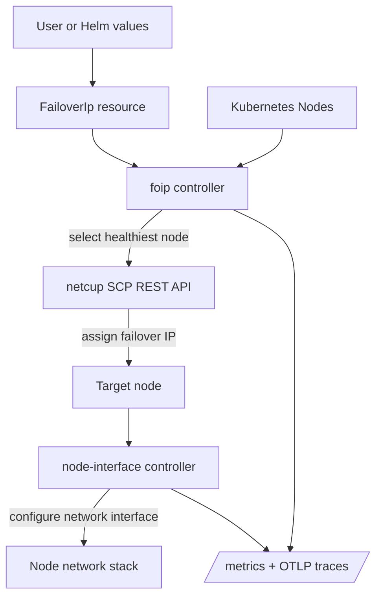

# Architecture

This document describes how `foip-operator` works internally, what the controllers do,
and where the important failure modes are.

## System Overview

The operator is split into two workloads:

- `foip` controller as a `Deployment`
- `node-interface` controller as a `DaemonSet`

The workloads cooperate to choose the healthiest node and make sure that node can
receive traffic for the failover IP.

## Controller Roles

### foip controller

The `foip` controller:

- Watches `FailoverIp` objects
- Watches Kubernetes nodes and their health conditions
- Chooses the healthiest eligible node
- Talks to the netcup SCP REST API
- Uses leader election so only one instance drives external assignment

### node-interface controller

The `node-interface` controller:

- Runs on every node
- Watches the node-specific `FailoverIp` state
- Ensures the local interface is prepared to receive the failover IP
- Avoids manual per-node network configuration

## Node Selection

Nodes are ranked by health. A node is only replaced when a strictly healthier node is
available.

Order of concern:

1. `NetworkUnavailable=True`
2. `Ready=False`
3. `Ready=Unknown`
4. `spec.unschedulable`
5. `PIDPressure=True`
6. `MemoryPressure=True`
7. `DiskPressure=True`

This avoids oscillation between equally healthy nodes and prevents alphabetical
flip-flopping.

## Make-Before-Break Failover

The failover flow is intentionally make-before-break:

1. The operator identifies the target node
2. The node-interface controller prepares the node-side network state
3. The external failover IP assignment moves
4. The old route is released only after the new path is ready

This reduces the chance of a gap where the IP is not reachable on either side.

## Netcup API and Credentials

The netcup SCP API uses OIDC. The repo includes a helper for generating a refresh token
that can be stored as a Kubernetes secret.

Important constraints:

- Refresh tokens need periodic use to remain valid
- API-based reassignment is not instantaneous
- Reconciliation can only help after the cluster sees a health change

## Observability

The operator exposes:

- Prometheus metrics on `/metrics`
- OpenTelemetry traces when OTLP environment variables are configured

Both controller binaries can emit metrics and traces. The Helm chart can disable either
signal independently.

## Detailed Limitations

### Failover is not immediate

This design depends on Kubernetes health detection. If a node dies suddenly, recovery
waits for Kubernetes to notice the failure and for the controller to reconcile. That can
take seconds or minutes depending on node failure mode and cluster timing.

### Netcup reassignment cooldown

Netcup failover IPs can only be reassigned every five minutes. If the cluster repeatedly
flaps between nodes, reassignment may be delayed by provider-side throttling.

### Equal-health nodes do not trigger a move

If two nodes are equally healthy, the operator keeps the current assignment. That
prevents churn, but it also means a “better-looking” node with the same score will not
take over.

### Manual annotations are required

The operator depends on node annotations for netcup server identity and primary MAC.
If either annotation is missing, the node is skipped.

### Secret access must be granted

If the controller does not have RBAC access to the secret containing netcup credentials,
reconciliation will fail. Helm-managed installs can create the needed Role and
RoleBinding automatically when configured correctly.

### Metrics and traces are optional

If metrics are disabled, scraping stops for that workload. If traces are disabled, OTLP
environment variables are not injected. This can be useful for constrained installs, but
it reduces visibility during failover incidents.

### Multi-arch and attestation artifacts

The published registry tag contains a multi-arch manifest plus attestation artifacts.
GitHub may display non-runnable entries such as `unknown/unknown` for attestations. That
is expected and does not mean the image is broken.

### Raw manifests and Helm are not identical

The Helm chart injects observability and deployment defaults that raw Kustomize manifests
do not automatically provide. If you bypass Helm, you must wire any optional environment
variables yourself.

## Operational Edge Cases

### Replacing the current node

If the current node becomes cordoned but remains otherwise healthy, the score changes but
the operator only switches if another node is strictly better.

### Lost network on one node

If one node loses network connectivity but the control plane does not immediately mark it
unavailable, the operator will keep routing until the health signal updates.

### DNS and registry metadata

Container registry metadata is split between image labels and manifest annotations. Some
fields appear only in the underlying image config, while others appear only on the
multi-arch manifest index.

### Release artifacts

Release publishing includes:

- Multi-arch images
- OCI metadata labels and manifest annotations
- SBOM generation
- Provenance attestation
- Image signing

These artifacts help consumers verify the release but do not affect runtime behavior.

