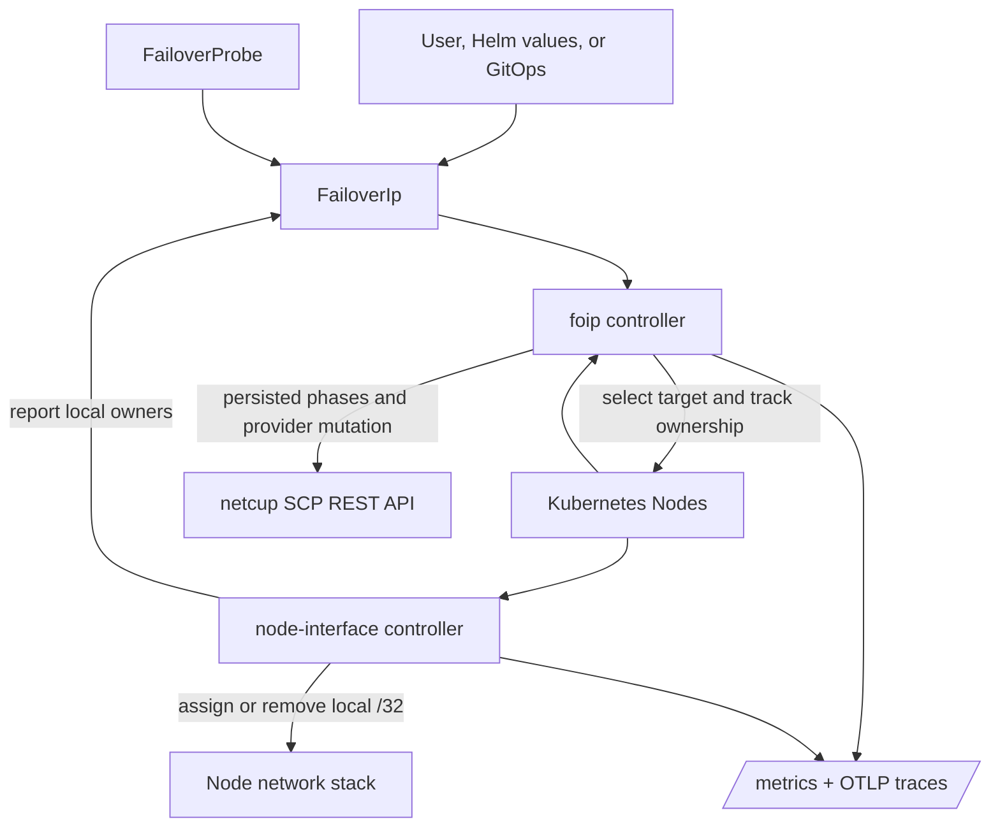

# Architecture

This document describes the current `foip-operator` design: a persisted,
restart-safe failover state machine backed by a provider controller and a
per-node interface controller.

## System Overview

The operator runs as two cooperating workloads:

- a `foip` controller `Deployment`
- a `node-interface` controller `DaemonSet`

The controller owns provider routing and the transition state machine. The
node-interface workload owns local `/32` assignment and cleanup on each node.
`FailoverProbe` resources provide reusable, provider-neutral health checks that
can be referenced from one or more `FailoverIp` resources.

## Data Model

`FailoverIp` is the primary resource. Its spec holds:

- the failover IP
- the netcup credential secret name
- safety knobs such as provider cooldown, retry delay, stabilization window,
  cleanup budget, and recovery policy
- optional references to reusable `FailoverProbe` resources

Its status persists the transition identity and the last known state of the
handoff:

- `TransitionID`
- `Phase`
- `SourceNode`
- `TargetNode`
- `ProviderObservedOwner`
- `LocalOwners`
- `PhaseStartedAt`
- `LastSuccessfulPhase`
- retry, cleanup, and recovery bookkeeping

`FailoverProbe` is namespaced, reusable, and optional. It supports:

- `PreRoute`, `PostRoute`, and `Continuous` phases
- `TCP`, `TLS`, `HTTP`, `HTTPS`, and `Kubernetes` executors
- `All`, `Any`, and quorum composition
- credential and CA bundle references without exposing secret values in status

## Controller Roles

### foip controller

The `foip` controller:

- watches `FailoverIp`, `FailoverProbe`, `Node`, and `Secret` resources
- validates persisted spec and status before resuming a transition
- selects candidate nodes from the annotated node set
- applies stabilization and hysteresis before any provider mutation
- verifies provider ownership before and after routing
- runs pre-route and post-route probes
- applies the configured recovery policy when post-route verification fails
- persists every material decision so a later reconcile can resume safely
- emits Conditions, events, metrics, and traces for material state changes

The controller uses leader election via controller-runtime, so only one replica
drives provider mutations at a time.

### node-interface controller

The `node-interface` controller:

- runs on every node
- watches `FailoverIp` resources plus the local `Node`
- uses the node's `foip.noshoes.xyz/primary-mac` annotation to find the local
  interface
- assigns the failover `/32` when the node is the current `SourceNode` or
  `TargetNode`
- removes stale ownership when the node is not part of the current transition
- reports local ownership back into `FailoverIp.status.localOwners`

This controller is intentionally idempotent. Re-running it on the same input
should not duplicate assignments or remove the address from the committed owner.

## Transition Flow

The persisted state machine moves through these phases:

`Idle -> Selecting -> Stabilizing -> PreparingTarget -> TargetPrepared -> RoutingProvider -> VerifyingProvider -> VerifyingTraffic -> Committing -> CleaningStaleOwners -> Succeeded`

The controller may also move to `Degraded` or `Blocked` when a safety gate
fails, a provider mutation cannot be verified, or a contradictory persisted
state is detected.

The important safety gates are:

1. choose only annotated candidate nodes
2. wait for the stabilization window and minimum healthy window
3. confirm the target node is locally prepared before routing
4. respect provider cooldown between mutations
5. re-read the provider until ownership converges
6. run pre-route and post-route probes at the configured phase
7. commit the transition only after the provider and local ownership agree
8. keep cleaning stale owners until exactly one node owns the `/32`

If post-route probes fail, the configured recovery policy determines the
outcome:

- `HoldDualOwnership` leaves the system in a visible degraded state
- `RollbackProvider` tries to restore the previous provider owner, bounded by
  cooldown and provider fencing
- `CommitDegraded` records the failure and stops trying to unwind the route
- `ManualIntervention` blocks the transition until a user supplies a new manual
  reconcile token

## Node Selection

Nodes are ranked by health. The controller prefers the node with the best score
and only switches when a strictly healthier node exists.

Health is ordered by the following issues, from most to least severe:

1. `NetworkUnavailable=True`
2. `Ready=False`
3. `Ready=Unknown`
4. `spec.unschedulable`
5. `PIDPressure=True`
6. `MemoryPressure=True`
7. `DiskPressure=True`

Nodes are eligible only when they have both the server ID annotation and the
primary MAC annotation. If the current owner is still as healthy as the best
candidate, the controller keeps the existing assignment to avoid flapping.

## Observability

The operator exposes:

- Kubernetes Conditions that track readiness, stabilization, target
  preparation, provider convergence, traffic verification, ownership
  convergence, degradation, cooldown, and blocked states
- deduplicated Kubernetes events for repeated failures and retries
- low-cardinality Prometheus metrics for reconciliation, provider calls,
  phase duration, cooldown blocks, probe outcomes, recovery actions, owner
  counts, and terminal failures
- OpenTelemetry spans correlated by transition ID
- structured logs with redaction for URLs, addresses, and credential-like
  values

These signals are intentionally generic. The docs and charts do not assume a
specific ingress controller, WAF, reverse proxy, or monitoring backend.

## Operational Notes

- Failover is not immediate; it depends on Kubernetes observing node health and
  the controller reconciling that state.
- Netcup reassignment is rate limited, so cooldown is persisted across
  reconciles and restarts.
- The operator can keep both the source and target nodes owning the `/32`
  while the handoff is in flight. Cleanup only removes stale ownership after
  provider convergence and verification.
- Manual retries use the `foip.noshoes.xyz/reconcile` annotation.
- Helm can create `FailoverIp` and `FailoverProbe` resources at install time;
  raw Kustomize installs must define them separately.

